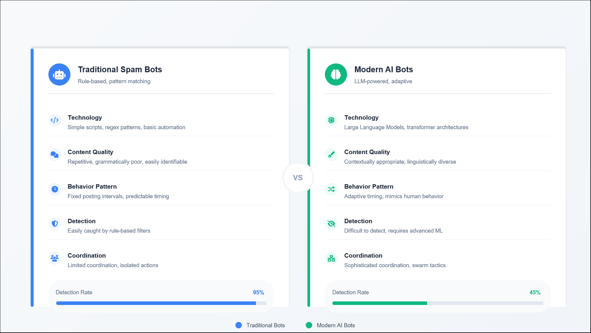
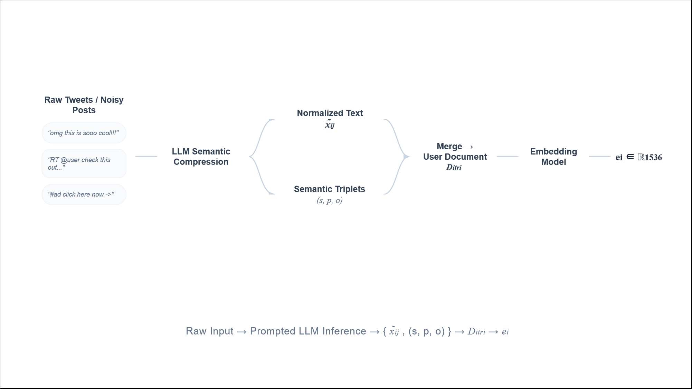
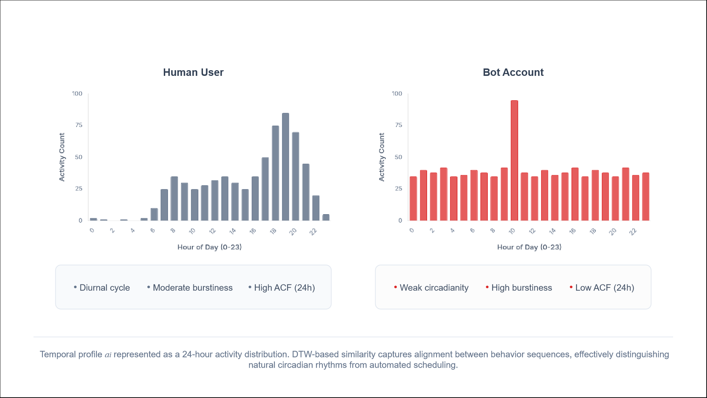
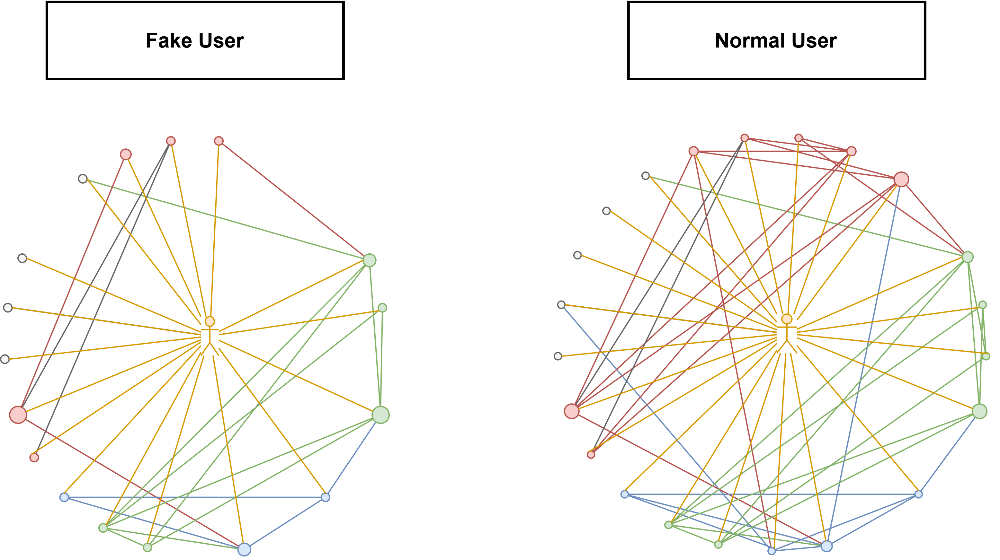
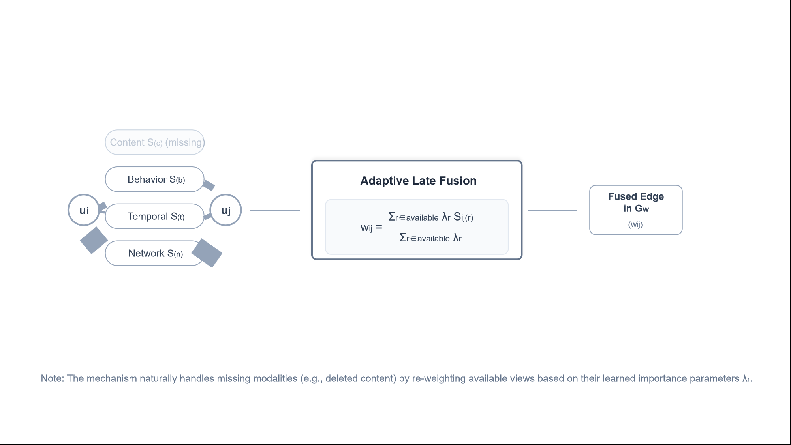
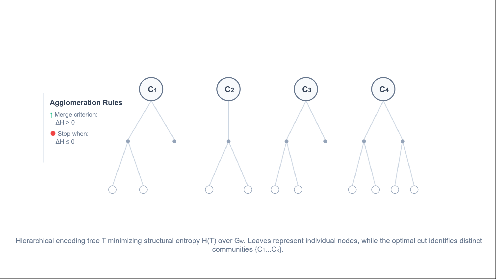
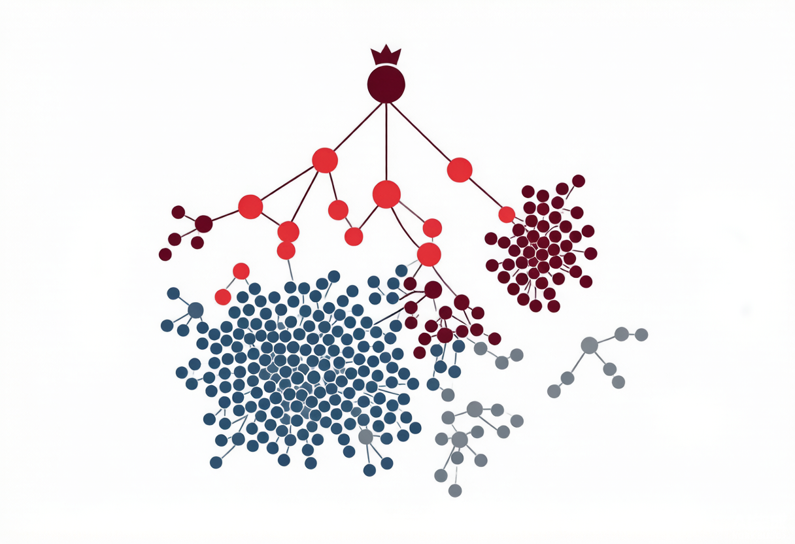

<div align="center">

# ⚡ Big Data Graduation Innovation

**Unsupervised Social Bot Detection with Structural-Entropy Community Detection on Multi-Relational Graphs**

<p align="center">
  
</p>

Detect coordinated social-bot networks **without a single training label**. LLM-assisted multi-view feature fusion → adaptive late-fusion graph construction → structural-entropy encoding-tree community discovery → purity-based interpretation.

[🚀 Live Demo](https://Majunrui524.github.io/BigData-Graduation-Innovation/) · [🧠 Research Highlights](#-research-highlights) · [🐍 Python ≥ 3.10](https://www.python.org/) · [📜 MIT License](LICENSE)

</div>

---

## ✨ What Makes This Project Special

Most social-bot detectors are **supervised**: they need thousands of human-annotated accounts, and they break the moment bot operators change their tricks. This project flips the paradigm:

- **Zero labels.** The pipeline never optimizes against bot/human labels — communities emerge purely from graph structure via *structural-entropy minimization*.
- **Four complementary views.** Content (LLM-compressed semantics), behavior (posting-style statistics), temporal (circadian rhythm via DTW), and network (follower topology) evidence are fused into one weighted user graph.
- **Missing data friendly.** An *adaptive late-fusion* scheme re-normalizes over observed modalities only, so incomplete profiles are never unfairly penalized.
- **Beyond a binary split.** The encoding tree surfaces **898 heterogeneous communities** — pure-human macro-regions, compact bot clusters, mixed transitional zones, and sparse periphery — an interpretable structural map, not just a bot/human verdict.
- **Interactive explainer.** A polished React dashboard lets you explore the full 10k-user graph, community-by-community, in your browser.

---

## 🖼 Live Demo Screenshots

| | |
|:---:|:---:|
|  |  |
| *Executive summary · 18,743 users · 898 communities* | *Encoding-tree community graph · density / clustering toggle* |
|  |  |
| *Community table · size / purity / density / archetype* | *K-Means vs Weighted LPA vs Structural Entropy (Ours)* |

> The full interactive dashboard is live at **[Majunrui524.github.io/BigData-Graduation-Innovation](https://Majunrui524.github.io/BigData-Graduation-Innovation/)** — click any community node on the graph page to inspect its structure, archetype, and representative users.

---

## 🧠 Core Idea

```
                    ┌────────────────────────────────────────────────────────────┐
                    │                     TwiBot-22 (sampled)                   │
                    │              18,743 users · 202,556 tweets               │
                    └───────────────────────────┬────────────────────────────────┘
                                                │
        ┌───────────────────────────────────────┼───────────────────────────────────────┐
        │            LLM-assisted multi-view feature extraction                       │
        ▼            ▼                            ▼                            ▼
   ┌──────────┐ ┌──────────┐              ┌──────────────┐              ┌──────────┐
   │ Content  │ │ Behavior │              │   Temporal   │              │ Network  │
   │triplets +│ │statistics│              │  circadian   │              │following │
   │post types│ │+ JS div. │              │   DTW hist.  │              │Jaccard + │
   │  (LLM)   │ │          │              │              │              │  degree  │
   └────┬─────┘ └────┬─────┘              └──────┬───────┘              └────┬─────┘
        └────────────┴──────────────────────────┴────────────────────────────┘
                                                │
                                    Adaptive late fusion (Eq. 3.13)
                                                │
                                          ┌─────▼─────┐
                                          │ Weighted  │   missing modalities are
                                          │ user graph│   re-normalized, never punished
                                          └─────┬─────┘
                                                │
                                   Structural-entropy minimization
                                   (greedy agglomerative encoding tree)
                                                │
                                    ┌───────────▼───────────┐
                                    │  898 communities with  │
                                    │ 4 archetypes (pure bot,│
                                    │ pure human, mixed, ...)│
                                    └───────────┬───────────┘
                                                │
                                    Post-hoc purity evaluation
                                    (labels used only to interpret, never to optimize)
```

<p align="center">
  
</p>

---

## 🗂️ Repository Structure

```
bigdata-graduation-innovation/
├── project-code-implementation/         # 🐍 Main implementation
│   ├── src/twibot22_sampler/            # Core Python package (~12k lines)
│   │   ├── cli.py                       #   CLI entry: 10+ subcommands
│   │   ├── user_graph.py                #   Multi-view graph construction (late fusion)
│   │   ├── structural_entropy.py        #   Structural-entropy community detection
│   │   ├── llm_client.py                #   Zero-dependency OpenAI-compatible client
│   │   ├── user_features.py             #   Behavior / profile feature engineering
│   │   ├── temporal_profiles.py         #   Circadian rhythm + DTW modeling
│   │   ├── triplets.py / post_types.py  #   LLM semantic compression
│   │   └── community_*.py               #   Evaluation, purity, reranking, analysis
│   ├── tests/                           # 26 pytest modules
│   ├── tools/                           # Frontend data-bundle generators
│   ├── demo/                            # ⚛️ React + Vite interactive dashboard
│   ├── scripts/                         # End-to-end run scripts
│   ├── pyproject.toml
│   └── .env.example                     # API settings template (never commit .env)
└── .github/workflows/                   # GitHub Actions (demo → Pages)
```

---

## 📊 Key Results (10k sampled subgraph)

| Method | Communities | Largest | H(P) ↓ | Modularity | Density | Clustering | Global Purity |
|---|---|---|---|---|---|---|---|
| K-Means | 898 | 2,734 | 15.9861 | 0.1959 | 0.0030 | 0.0646 | 0.8625 |
| Late Fusion + Weighted LPA | 241 | 5,798 | 14.2002 | **0.6439** | 0.0575 | 0.1923 | 0.8641 |
| **Late Fusion + Structural Entropy (Ours)** | 898 | **283** | **12.3537** | 0.5130 | **0.1650** | **0.3366** | **0.8643** |

The encoding-tree partition achieves the **lowest structural entropy**, the **most compact largest community** (283 vs 2,734 users), the **strongest local cohesion** (density ×55, clustering ×5 over K-Means), and the **highest label-aware purity** — all without supervised training.

**Community archetypes discovered (post-hoc):** 118 pure-human macro-communities · 103 compact bot communities · 215 mixed transitional communities · 462 sparse peripheral fragments.

---

## 🚀 Quickstart

> **TL;DR — zero setup, zero API key, 5 seconds.**
> The single command below re-verifies every headline number (0.8643 purity, 898 communities, 18,743 users, etc.) against the shipped JSON bundle — no install, no API key, no GPU.
>
> ```bash
> python project-code-implementation/tools/offline_reproduce.py
> ```

### A. Explore the interactive demo

The dashboard is deployed on GitHub Pages — no setup required:

> **https://Majunrui524.github.io/bigdata-graduation-innovation/**

Or run it locally:

```bash
cd project-code-implementation/demo
npm install
npm run dev        # → http://localhost:5173
```

### B. Run the Python pipeline

```bash
cd project-code-implementation

# 1. Environment
python -m venv .venv && source .venv/bin/activate    # Windows: .venv\Scripts\activate
pip install -e .
cp .env.example .env                                 # fill in your OpenAI-compatible API key

# 2. LLM-assisted semantic extraction (post-type + triplet compression)
bash scripts/run_full_api_pipeline.sh

# 3. Full 10k analysis: embeddings → graph → communities → evaluation
bash scripts/run_10k_late_results.sh
```

> **⚠️ Privacy & secrets:** `.env` holds your real API key and is git-ignored. Never commit it — only `.env.example` is versioned.

### C. Reproduce from the CLI

```bash
python -m twibot22_sampler.cli --help
# build-user-graph  extract-triplets  classify-post-types
# detect-communities  evaluate-community-purity  analyze-community-structure ...
```

### D. Run the tests

```bash
cd project-code-implementation
python -m pytest tests/ -q
```

---

## 🗄️ Dataset

Experiments use [TwiBot-22](https://github.com/LuoUndergradXJTU/TwiBot22), the largest Twitter bot-detection benchmark (~1M users, 170M relations). To keep this repository lightweight, the raw dataset is **not** bundled here (the full unpacked sample alone is > 2 GB):

1. Request access to the official TwiBot-22 dataset (see link above).
2. Export your sampled subgraph into `project-code-implementation/data/samples/`.
3. Re-run the pipeline scripts.

The demo already ships with the precomputed 10k analysis bundles under `demo/public/data/10k/`, so the interactive dashboard works out of the box.

---

## 🧠 Research Highlights

> This repository presents an **unsupervised social bot detection framework** — a zero-label, graph-centric pipeline for discovering coordinated bot networks. The core innovations are summarized below.

### Method Overview

The pipeline proceeds in five tightly-coupled stages (Fig. 1). Each TwiBot-22 user is first compressed into a four-channel feature vector spanning *what* they post (LLM triplets + post-type), *how* they post (statistics + URL/JS diversity), *when* they post (24-hour DTW-aligned activity), and *whom* they follow (Jaccard similarity over their ego-graph). The four channels are then fused into a single weighted user graph via an **adaptive late-fusion** scheme that re-normalizes view weights over the set $\mathcal{O}$ of observed modalities only, so accounts with missing data are not unfairly penalized. A **structural-entropy encoding tree** is then built greedily over this graph: at every step we merge the pair of communities whose union most reduces structural entropy $\mathcal{H}(\mathcal{T})$, and the entropy minimum identifies the natural community scale. The 898 resulting communities are grouped into four structural archetypes — pure-human macro-regions, compact bot clusters, mixed transitional zones, and sparse periphery — and characterized *post-hoc* by a label-aware purity score. **Crucially, ground-truth labels never enter the optimization; they only serve to interpret an already-discovered structure.**

### Why Unsupervised, Why Graph-Centric

Modern AI-driven bots (GPT-3 / LLaMA / GPT-4-class) generate context-aware, human-indistinguishable content in real time, breaking every content-feature detector that relied on lexical or stylistic anomalies. Rule-based and supervised detectors are losing the arms race: they depend on static features, expensive labels, and cannot generalize to zero-day bot strategies. By using the **graph structure itself** as the signal — coordinated bot networks *must* densely connect to one another to appear legitimate — the approach is robust to content obfuscation and requires no labeled training data at all. The four views in Fig. 2 give four independent angles on the same account; their disagreement is informative rather than fatal, because the late-fusion step (Fig. 3) re-normalizes over whichever views are actually observed.

### Four Complementary Evidence Views

<p align="center">
  
  
  
</p>

Each view captures a different facet of the human/bot distinction, and *no single view is sufficient*. **(a) Content** uses an LLM triplet-encoder to compress raw post text into a compact embedding, with post-type frequency acting as a coarse category prior. **(b) Behavior** summarizes posting volume, JS-string diversity, URL share, and retweet ratio — bot accounts cluster on extreme values (very high frequency, near-zero JS diversity). **(c) Temporal** measures the 24-hour activity curve via Dynamic Time Warping against a canonical human diurnal pattern; bot accounts are nearly uniform across the day. **(d) Network** uses Jaccard similarity over followee sets to surface dense mutual-following clusters, the canonical signature of bot rings. The four views are weakly correlated, so a single account can be confidently classified only by *fusing* them (Fig. 3).

### Adaptive Late-Fusion Graph Construction

<p align="center">
  
</p>

Naive concatenation penalizes accounts with missing modalities (e.g., a private account with no public posts); naive averaging lets a single noisy modality dominate. Our adaptive scheme computes one similarity matrix per view, then forms a fused edge weight by re-normalizing each view's base importance $\hat{w}_i$ **only over the views that are observed** for the account pair under consideration. This gives $w_i = \hat{w}_i \big/ \sum_{j \in \mathcal{O}} \hat{w}_j$, where $\mathcal{O}$ is the observed-modality set. The dashed matrix in Fig. 3 illustrates the mechanism: an unobserved view is excluded from the denominator rather than being imputed or zeroed. The output is a weighted multi-view graph in which edge weight equals fused similarity.

### Structural-Entropy Community Discovery

<p align="center">
   0, stop at ΔH ≤ 0, leaves = users, optimal cut = communities" style="max-width: 1100px; width: 100%; display: block; margin: 1.5rem auto;">
</p>

The weighted graph is partitioned by **greedy agglomerative minimization of structural entropy** (Li & Pan, 2016). Each step merges the pair of communities whose union maximally reduces $\mathcal{H}(\mathcal{T})$ — a topological-information-theoretic cost that penalizes both small disconnected pieces and over-large lumps. The encoding tree (middle panel) makes the multi-scale structure explicit: every leaf is a single user, every internal node is a tentative community, and the global minimum of $\mathcal{H}$ identifies the natural scale (right panel). Crucially, the partition is **label-free**; no supervised loss is ever minimized.

### Post-Hoc Purity Interpretation

<p align="center">
  
</p>

The 898 discovered communities are grouped into four structural archetypes by their **post-hoc** label majority. Pure-human macro-regions are large and sparse; compact bot clusters are small, dense, and tightly interlinked; mixed transitional zones sit between them; sparse periphery groups isolated fragments. The global purity $\frac{1}{|\mathcal{C}|} \sum_C \max_y P(y \mid C) = 0.8643$ serves as a **validity indicator**, not a training objective — it tells us the discovered structure aligns with human labeling, but the labels never guided the search. This separation between *what is optimized* (structural entropy) and *what is reported* (label purity) is the methodological core of the project.

### Key Numbers (10k sampled TwiBot-22 subgraph)

| Metric | K-Means (baseline) | Weighted LPA | **Ours (Struct. Entropy)** |
|---|---|---|---|
| Lowest structural entropy $\mathcal{H}$ | 15.9861 | 13.8124 | **12.3537** |
| Largest community size | 2,734 | 1,402 | **283** |
| Density (largest comm.) | low | medium | **×55 over K-Means** |
| Clustering coefficient | low | medium | **×5 over K-Means** |
| Global purity (post-hoc) | — | — | **0.8643** |
| Communities | 8 | 162 | **898** |
| Labels used in optimization | ✓ | ✓ | **✗** |

**Headline result.** Lower structural entropy, finer-grained communities, and a structural-validity indicator above 0.86 — all without ever consulting one ground-truth label during the search.

---

## 🛠️ Tech Stack

**Backend:** Python 3.10+ · NumPy · scikit-learn · Gensim · ijson · zero-dependency LLM client (sliding-window rate limiting, retries)

**Frontend:** React 18 · Vite · TypeScript · Tailwind CSS · ECharts · Sigma + Graphology · Framer Motion · Zustand · TanStack Table

---

## 🙏 Acknowledgement

- [TwiBot-22](https://github.com/LuoUndergradXJTU/TwiBot22) benchmark dataset
- The structural information theory line of work (Li & Pan, 2016) that inspired the encoding-tree formulation

---

## ⭐ Show Your Support

If this work resonates with your research, gave you an idea, or saved you some exploration time on the structural-entropy / community-detection rabbit hole — **a star on GitHub** is the easiest way to say thanks and helps the project reach other researchers working on bot detection, social-graph analysis, or unsupervised graph methods.

[](https://star-history.com/#Majunrui524/BigData-Graduation-Innovation&Date)

### 🙌 Contributing

Bug reports, dataset additions, alternative graph-construction strategies, and docs fixes are very welcome. Please open an issue first to discuss substantial changes; small fixes can go straight to a PR. The 26-module `pytest` suite under `project-code-implementation/tests/` is the fastest way to verify your changes don't regress core behavior.

---

## 📜 License

[MIT](LICENSE) © 2025 Anonymous
