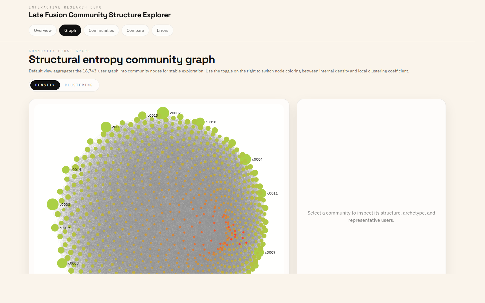
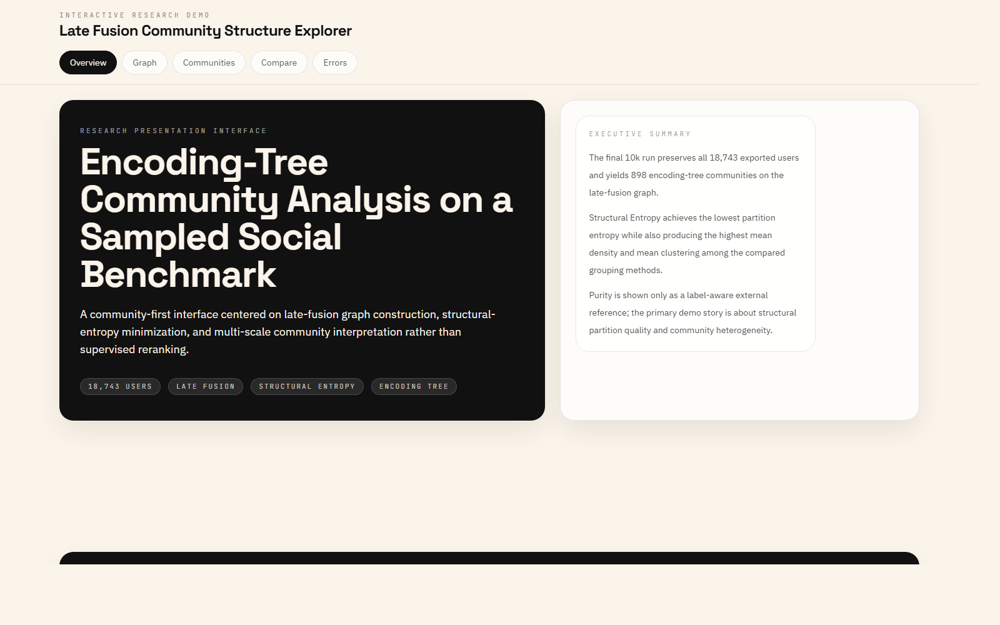
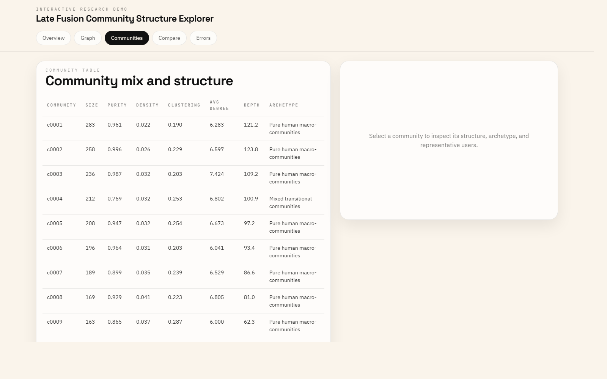
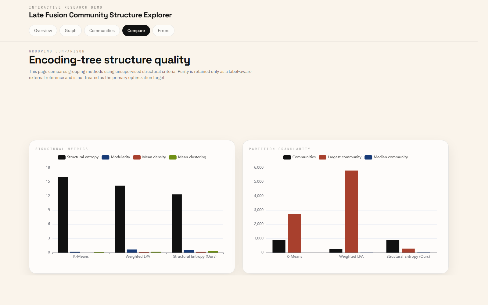

<div align="center">

# ⚡ Big Data Graduation Innovation

**Unsupervised Social Bot Detection with Structural-Entropy Community Detection on Multi-Relational Graphs**

<p align="center">
  
</p>

Detect coordinated social-bot networks **without a single training label**. LLM-assisted multi-view feature fusion → adaptive late-fusion graph construction → structural-entropy encoding-tree community discovery → purity-based interpretation.

[🚀 Live Demo](https://Majunrui524.github.io/BigData-Graduation-Innovation/) · [📄 Paper (PDF)](paper/Outstanding-Graduation-Innovation-Project.pdf) · [🐍 Python ≥ 3.10](https://www.python.org/) · [📜 MIT License](LICENSE)

</div>

---

## ✨ What Makes This Project Special

Most social-bot detectors are **supervised**: they need thousands of human-annotated accounts, and they break the moment bot operators change their tricks. This project flips the paradigm:

- **Zero labels.** The pipeline never optimizes against bot/human labels — communities emerge purely from graph structure via *structural-entropy minimization*.
- **Four complementary views.** Content (LLM-compressed semantics), behavior (posting-style statistics), temporal (circadian rhythm via DTW), and network (follower topology) evidence are fused into one weighted user graph.
- **Missing data friendly.** An *adaptive late-fusion* scheme re-normalizes over observed modalities only, so incomplete profiles are never unfairly penalized.
- **Beyond a binary split.** The encoding tree surfaces **898 heterogeneous communities** — pure-human macro-regions, compact bot clusters, mixed transitional zones, and sparse periphery — an interpretable structural map, not just a bot/human verdict.
- **Interactive explainer.** A polished React dashboard lets you explore the full 10k-user graph, community-by-community, in your browser.

---

## 🖼 Live Demo Screenshots

| | |
|:---:|:---:|
|  |  |
| *Executive summary · 18,743 users · 898 communities* | *Encoding-tree community graph · density / clustering toggle* |
|  |  |
| *Community table · size / purity / density / archetype* | *K-Means vs Weighted LPA vs Structural Entropy (Ours)* |

> The full interactive dashboard is live at **[Majunrui524.github.io/BigData-Graduation-Innovation](https://Majunrui524.github.io/BigData-Graduation-Innovation/)** — click any community node on the graph page to inspect its structure, archetype, and representative users.

---

## 🧠 Core Idea

```
                    ┌────────────────────────────────────────────────────────────┐
                    │                     TwiBot-22 (sampled)                   │
                    │              18,743 users · 202,556 tweets               │
                    └───────────────────────────┬────────────────────────────────┘
                                                │
        ┌───────────────────────────────────────┼───────────────────────────────────────┐
        │            LLM-assisted multi-view feature extraction                       │
        ▼            ▼                            ▼                            ▼
   ┌──────────┐ ┌──────────┐              ┌──────────────┐              ┌──────────┐
   │ Content  │ │ Behavior │              │   Temporal   │              │ Network  │
   │triplets +│ │statistics│              │  circadian   │              │following │
   │post types│ │+ JS div. │              │   DTW hist.  │              │Jaccard + │
   │  (LLM)   │ │          │              │              │              │  degree  │
   └────┬─────┘ └────┬─────┘              └──────┬───────┘              └────┬─────┘
        └────────────┴──────────────────────────┴────────────────────────────┘
                                                │
                                    Adaptive late fusion (Eq. 3.13)
                                                │
                                          ┌─────▼─────┐
                                          │ Weighted  │   missing modalities are
                                          │ user graph│   re-normalized, never punished
                                          └─────┬─────┘
                                                │
                                   Structural-entropy minimization
                                   (greedy agglomerative encoding tree)
                                                │
                                    ┌───────────▼───────────┐
                                    │  898 communities with  │
                                    │ 4 archetypes (pure bot,│
                                    │ pure human, mixed, ...)│
                                    └───────────┬───────────┘
                                                │
                                    Post-hoc purity evaluation
                                    (labels used only to interpret, never to optimize)
```

---

## 🗂️ Repository Structure

```
bigdata-graduation-innovation/
├── paper/                               # 📄 Thesis report (PDF)
│   └── Outstanding-Graduation-Innovation-Project.pdf
├── project-code-implementation/         # 🐍 Main implementation
│   ├── src/twibot22_sampler/            # Core Python package (~12k lines)
│   │   ├── cli.py                       #   CLI entry: 10+ subcommands
│   │   ├── user_graph.py                #   Multi-view graph construction (late fusion)
│   │   ├── structural_entropy.py        #   Structural-entropy community detection
│   │   ├── llm_client.py                #   Zero-dependency OpenAI-compatible client
│   │   ├── user_features.py             #   Behavior / profile feature engineering
│   │   ├── temporal_profiles.py         #   Circadian rhythm + DTW modeling
│   │   ├── triplets.py / post_types.py  #   LLM semantic compression
│   │   └── community_*.py               #   Evaluation, purity, reranking, analysis
│   ├── tests/                           # 26 pytest modules
│   ├── tools/                           # Frontend data-bundle generators
│   ├── demo/                            # ⚛️ React + Vite interactive dashboard
│   ├── scripts/                         # End-to-end run scripts
│   ├── pyproject.toml
│   └── .env.example                     # API settings template (never commit .env)
└── .github/workflows/                   # GitHub Actions (demo → Pages)
```

---

## 📊 Key Results (10k sampled subgraph)

| Method | Communities | Largest | H(P) ↓ | Modularity | Density | Clustering | Global Purity |
|---|---|---|---|---|---|---|---|
| K-Means | 898 | 2,734 | 15.9861 | 0.1959 | 0.0030 | 0.0646 | 0.8625 |
| Late Fusion + Weighted LPA | 241 | 5,798 | 14.2002 | **0.6439** | 0.0575 | 0.1923 | 0.8641 |
| **Late Fusion + Structural Entropy (Ours)** | 898 | **283** | **12.3537** | 0.5130 | **0.1650** | **0.3366** | **0.8643** |

The encoding-tree partition achieves the **lowest structural entropy**, the **most compact largest community** (283 vs 2,734 users), the **strongest local cohesion** (density ×55, clustering ×5 over K-Means), and the **highest label-aware purity** — all without supervised training.

**Community archetypes discovered (post-hoc):** 118 pure-human macro-communities · 103 compact bot communities · 215 mixed transitional communities · 462 sparse peripheral fragments.

---

## 🚀 Quickstart

### A. Explore the interactive demo

The dashboard is deployed on GitHub Pages — no setup required:

> **https://Majunrui524.github.io/bigdata-graduation-innovation/**

Or run it locally:

```bash
cd project-code-implementation/demo
npm install
npm run dev        # → http://localhost:5173
```

### B. Run the Python pipeline

```bash
cd project-code-implementation

# 1. Environment
python -m venv .venv && source .venv/bin/activate    # Windows: .venv\Scripts\activate
pip install -e .
cp .env.example .env                                 # fill in your OpenAI-compatible API key

# 2. LLM-assisted semantic extraction (post-type + triplet compression)
bash scripts/run_full_api_pipeline.sh

# 3. Full 10k analysis: embeddings → graph → communities → evaluation
bash scripts/run_10k_late_results.sh
```

> **⚠️ Privacy & secrets:** `.env` holds your real API key and is git-ignored. Never commit it — only `.env.example` is versioned.

### C. Reproduce from the CLI

```bash
python -m twibot22_sampler.cli --help
# build-user-graph  extract-triplets  classify-post-types
# detect-communities  evaluate-community-purity  analyze-community-structure ...
```

### D. Run the tests

```bash
cd project-code-implementation
python -m pytest tests/ -q
```

---

## 🗄️ Dataset

Experiments use [TwiBot-22](https://github.com/LuoUndergradXJTU/TwiBot22), the largest Twitter bot-detection benchmark (~1M users, 170M relations). To keep this repository lightweight, the raw dataset is **not** bundled here (the full unpacked sample alone is > 2 GB):

1. Request access to the official TwiBot-22 dataset (see link above).
2. Export your sampled subgraph into `project-code-implementation/data/samples/`.
3. Re-run the pipeline scripts.

The demo already ships with the precomputed 10k analysis bundles under `demo/public/data/10k/`, so the interactive dashboard works out of the box.

---

## 📄 Paper & Citation

This repository is the code release for the undergraduate thesis:

> **Anonymous.** *Intelligent Detection of Human-Machine Accounts on Social Media Platforms Using Community Detection based on Multi-relational Graph.* Bachelor's Thesis, Anonymous School, Anonymous Institution, 2025. [PDF](paper/Outstanding-Graduation-Innovation-Project.pdf)

If you use this work in your research, please cite it (BibTeX):

```bibtex
@thesis{ma2025botdetection,
  title  = {Intelligent Detection of Human-Machine Accounts on Social Media Platforms Using Community Detection based on Multi-relational Graph},
  author = {Anonymous},
  school = {Anonymous Institution},
  year   = {2025}
}
```

---

## 🛠️ Tech Stack

**Backend:** Python 3.10+ · NumPy · scikit-learn · Gensim · ijson · zero-dependency LLM client (sliding-window rate limiting, retries)

**Frontend:** React 18 · Vite · TypeScript · Tailwind CSS · ECharts · Sigma + Graphology · Framer Motion · Zustand · TanStack Table

---

## 🙏 Acknowledgement

- [TwiBot-22](https://github.com/LuoUndergradXJTU/TwiBot22) benchmark dataset
- The structural information theory line of work (Li & Pan, 2016) that inspired the encoding-tree formulation

---

## ⭐ Show Your Support

If this work resonates with your research, gave you an idea, or saved you some exploration time on the structural-entropy / community-detection rabbit hole — **a star on GitHub** is the easiest way to say thanks and helps the project reach other researchers working on bot detection, social-graph analysis, or unsupervised graph methods.

[](https://star-history.com/#Majunrui524/BigData-Graduation-Innovation&Date)

### 🙌 Contributing

Bug reports, dataset additions, alternative graph-construction strategies, and docs fixes are very welcome. Please open an issue first to discuss substantial changes; small fixes can go straight to a PR. The 26-module `pytest` suite under `project-code-implementation/tests/` is the fastest way to verify your changes don't regress core behavior.

---

## 📜 License

[MIT](LICENSE) © Anonymous
